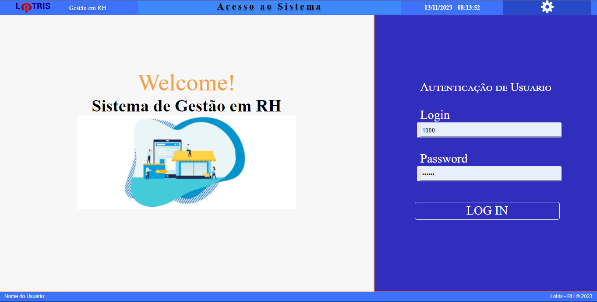
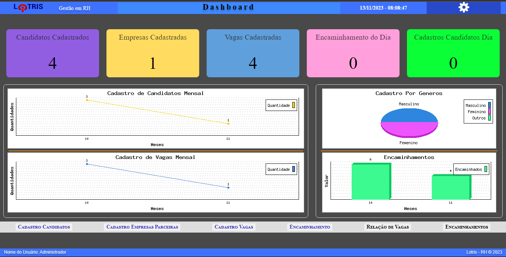
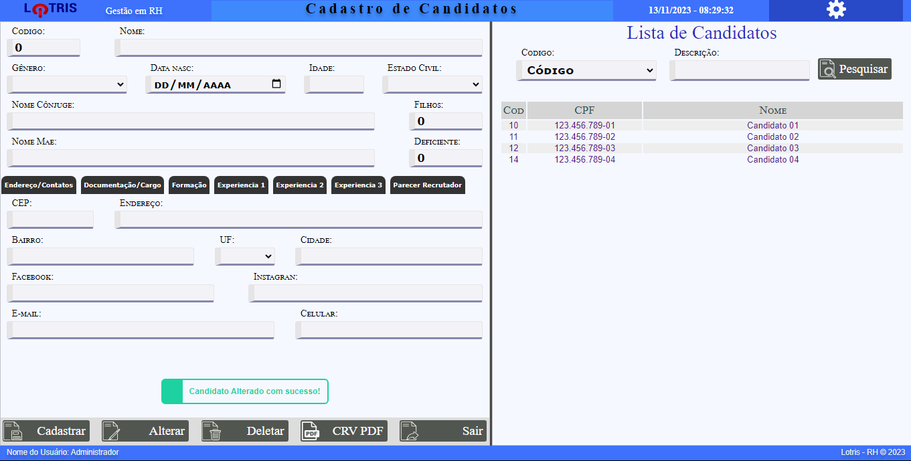

<h1 align="center">
    
</h1>
<h4 align="center"> 
# php-RH-lotris - Lotris - Gestao em RH
</h4>

## 💻 Sobre o projeto

♻ ️Gestao em RH - Sistema de Gestão de atividades basica na administração em uma empresa de Recursos Humanos.

As empresas ou entidades poderão realizar:
- Cadastros:
    Configuração da Empresa
    Cadastrar empresas parceiras
    Cadastrar vagas das emprsas parceiras
    Cadastrar de candidatos
    Cadastrar dos Encaminhamento de candidatos as empresa
- Dashboard
    Informações basicas em só tela, com graficos e tabelas.
- Envio poe e-mail de carta de Encaminhamento de candidatos as empresas parceiras.
- Gera um curriculo padrao de candidatos.
- Relatórios de vagas
- Relatórios de encaminhamentos
- Relatórios de cadastro de candidatos
- Relatórios de empresas parceiras

Projeto desenvolvido para ajudar na Gestão na empresas de Recursos Humanos.

## 🎨 Layout

O layout da aplicação está disponível no Figma:

   

  

## 🛠 Tecnologias

As seguintes ferramentas foram usadas na construção do projeto:

- [PHP8][php8]
- [Javascript][javascript]
- [Css][css]
- [Jquery][jquery]

## 📝 Licença

Este projeto esta sobe a licença MIT.

Feito com ❤️ por Marcos Andre 👋🏽 [Entre em contato!](www.linkedin.com/in/mare-marcos-andre/)

